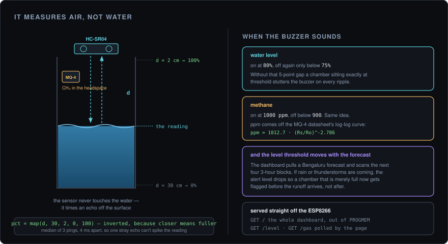

<div align="center">


# Project HYDRA

**A sewage chamber that tells you before it overflows.**

Ultrasonic depth, methane in the headspace, and a dashboard the microcontroller serves itself. No cloud, no broker, no subscription.

<p>
  
  
  
  
  
</p>

<br />



<sub>Open <code>http://&lt;esp-ip&gt;/</code> on any device on the network. The board is the web server.</sub>

</div>

<br />

---

## The short version

Mount an ultrasonic sensor in the roof of a tank or sewage chamber. It pings the water surface four times a second, converts the echo time into a fill percentage, and shows it on an onboard OLED. An MQ-4 alongside it watches for methane. A buzzer goes off when either crosses its line — and the water threshold drops on its own when rain is in the forecast, so a chamber that's merely full gets flagged *before* the runoff arrives.

The dashboard is not a separate app. The ESP8266 serves the whole thing — HTML, CSS, JavaScript, SVG icons — out of `PROGMEM`, so anything with a browser on the same network is a client.

---

## Read this before you flash it

**The dashboard shows six nodes; one of them is real.** `KR Puram Chamber` reflects the sensors actually attached to your board. The other five are simulated, so the multi-node layout, the map, and the overview page have something to display. If you're evaluating this, that's the thing to know first — everything below about *sensing* concerns one node.

**There's an OpenWeatherMap key committed in `hydra.html`.** It needs rotating and moving out of tracked source. Wi-Fi credentials are handled properly via a gitignored `secrets.h`; the weather key isn't, yet.

---

## Hardware

| Part | Detail |
|---|---|
| Microcontroller | ESP8266 — NodeMCU or Wemos D1 Mini |
| Level sensor | HC-SR04 ultrasonic |
| Gas sensor | MQ-4 methane / natural gas |
| Display | SH1106 128×64 I²C OLED — optional |
| Buzzer | Any active 3.3–5 V buzzer |
| Power | USB or a 5 V supply |

### Wiring

| ESP8266 | Connects to |
|---|---|
| D6 (GPIO 12) | HC-SR04 `TRIG` |
| D7 (GPIO 13) | HC-SR04 `ECHO` |
| D5 (GPIO 14) | Buzzer `+` |
| A0 | MQ-4 `AO` |
| D1 / D2 | OLED `SCL` / `SDA` |
| 3V3 · GND | Everything's power rails |

> **The MQ-4's analog output can swing to ~5 V, and the ESP8266's A0 tops out around 3.3 V.** Put a divider on that line, or use a module with one built in. This is the connection that quietly kills boards.

The MQ-4 also needs a burn-in before its readings settle — hours on first power-up, a few minutes on subsequent ones. Early numbers drift high; that's the sensor, not the code.

---

## Flashing it

1. Arduino IDE, with the ESP8266 board package installed.
2. Libraries: `Adafruit_SH110X`, `Adafruit_GFX`, `ArduinoJson`.
3. Credentials — copy the template rather than editing tracked files:

```bash
cp secrets.h.example secrets.h
```

```c
const char* ssid     = "your-network";
const char* password = "your-password";
```

`secrets.h` is gitignored, so it never lands in a commit.

4. Select your board, upload, then open the Serial Monitor at 115200 to read the assigned IP.
5. Visit `http://<that-ip>/` from anything on the same network.

---

## How it decides

<div align="center">

</div>

**It measures air, not water.** The sensor reports the distance to the surface, so the reading gets *smaller* as the tank fills. `map(d, 30, 2, 0, 100)` inverts it: 30 cm of air is empty, 2 cm is full. Both ends are configurable via `TANK_EMPTY_CM` and `TANK_FULL_CM` — measure your own chamber, because those two numbers are the calibration.

**Three pings, and it takes the middle one.** Ultrasonic sensors return the occasional wild value — a stray echo off a wall, a splash, a bit of foam. A median of three readings 4 ms apart discards the outlier without the lag a running average would add.

**Both alerts have a deadband.** The buzzer turns on at 80% and doesn't turn off until the level drops below 75%. Methane turns on at 1000 ppm, off below 900. Without those gaps, a chamber resting exactly at the threshold stutters the buzzer on every ripple — the same hysteresis idea in two places.

**Methane comes off the datasheet curve.** The MQ-4's resistance ratio maps to ppm through `ppm = 1012.7 · (Rs/Ro)^-2.786`, fitted to the CH₄ curve in the datasheet, with a few Rs samples averaged so one noisy ADC read can't spike it.

**The threshold follows the weather.** The dashboard pulls a Bengaluru forecast and scans the next four 3-hour blocks for rain, drizzle, or thunderstorms. If any of them hit, the alert level drops from 80% to 60% and the badge switches to *Monsoon*. A chamber at 65% is fine on a clear day and a problem an hour before a downpour, and this is the difference between the two.

---

## What it exposes

| Endpoint | Returns |
|---|---|
| `GET /` | The entire dashboard, from `PROGMEM` |
| `GET /level` | Current fill percentage and raw distance |
| `GET /gas` | Current methane estimate in ppm |

The page polls `/level` roughly every 0.8 s and `/gas` every second. If the ESP is unreachable, the dashboard falls back to simulated data for the live node rather than showing a broken panel — convenient for demos, worth remembering when you're debugging and the numbers look suspiciously healthy.

---

## Tuning

Everything lives in `#define`s at the top of `water.ino`.

| Constant | Default | Meaning |
|---|---|---|
| `TANK_EMPTY_CM` · `TANK_FULL_CM` | `30` · `2` | Distance readings that mean 0% and 100%. **Measure yours** |
| `ALERT_PERCENT` · `ALERT_RELEASE` | `80` · `75` | Water buzzer on / off thresholds |
| `GAS_ALERT_PPM` · `GAS_RELEASE_PPM` | `1000` · `900` | Methane buzzer on / off |
| `GAS_WARN_PPM` | `100` | "Elevated" band on the display, no buzzer |
| `SENSOR_INTERVAL` · `GAS_INTERVAL` | `250` · `1000` ms | Sampling rates |
| `MQ4_RL_KOHM` · `MQ4_CLEAN_AIR` | `10.0` · `4.4` | Load resistor, and clean-air Rs/Ro from the datasheet |
| `MQ4_CURVE_A` · `MQ4_CURVE_B` | `1012.7` · `-2.786` | The fitted ppm curve |

---

## On the OLED

Fill percentage, a level bar, live CH₄ in ppm with a status word, and a Wi-Fi indicator that reads `----` when the connection drops. Refreshed every 300 ms — slower than the sensor, because redrawing an I²C display is the most expensive thing in the loop and there's no point doing it faster than an eye can read it.

The board keeps sensing and alerting with the display disconnected. It's genuinely optional.

---

## Layout

```
hydra/
├── water.ino            firmware — sensing, OLED, web server, alerts
├── hydra.html           the dashboard, embedded into the firmware
├── secrets.h.example    Wi-Fi template — copy to secrets.h
├── hydra_icon.svg
├── oled_mockup.svg
└── docs/                the diagram in this README
```

---

## Known limits

- **One real node.** The other five are simulated for layout.
- **The weather key is client-side.** The dashboard runs in your browser, so any key it uses is visible to anyone who loads the page. Proxying the forecast through the ESP is the fix.
- **No history.** Readings aren't stored; the trend chart is a 60-second rolling window in the page, and it resets on reload.
- **LAN only.** There's no authentication on any endpoint, which is fine on a home network and not fine anywhere port-forwarded.
- **The MQ-4 is uncalibrated in absolute terms.** Good for "methane is rising", not for a number you'd report to anyone.
